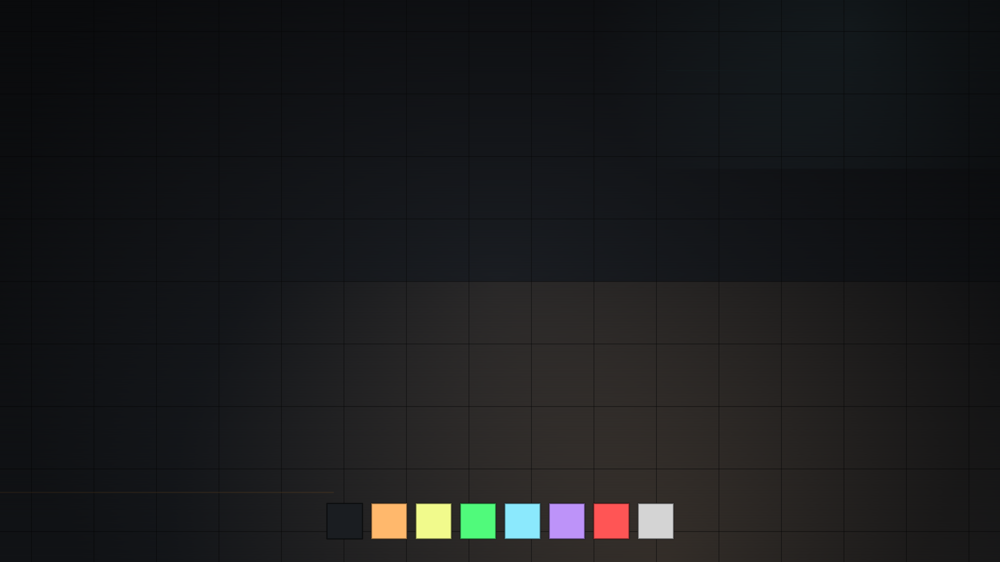

# Omarchy Cassette Futurism Theme

An [Omarchy](https://omarchy.org/) theme based on the Cassette Futurism palette —
**Analog Dream: Magnetic Night**: dark CRT console colors with amber and
phosphor accents. Light variant: [omarchy-cassette-futurism-light-theme](https://github.com/taotao7/omarchy-cassette-futurism-light-theme).



## Install

```bash
omarchy theme install https://github.com/taotao7/omarchy-cassette-futurism-theme.git
~/.config/omarchy/themes/cassette-futurism/fcitx5/apply.sh
```

`omarchy theme install` already applies the desktop theme. Omarchy does not run scripts shipped in a theme, so the second command is what points fcitx5 at this palette: ink background, amber border, selection pill, 8px corners. It also installs a `theme-set` hook. After that, switching theme — including to the light variant — repaints the candidate window from the active palette. Running `apply.sh` from either checkout is enough.

## Palette

| Role | Color |
|------|-------|
| Background | `#1a1d21` |
| Foreground | `#d4d4d4` |
| Accent (amber) | `#ffb86c` |
| Selection | `#3a4a5a` |
| Red | `#ff5555` |
| Yellow | `#f1fa8c` |
| Green | `#50fa7b` |
| Cyan | `#8be9fd` |
| Purple | `#bd93f9` |

The theme ships `colors.toml` plus a retro-futurism artwork background,
and hand-tuned `btop.theme` and
`helix.toml`, plus a `shell.controls.toml` section override that keeps buttons and other controls visible (stronger fills, amber accent borders). `fcitx5/apply.sh` paints the fcitx5 candidate window from the same palette. Terminal, Hyprland, shell, and editor configs are generated
from the palette by Omarchy's templates.

## Attribution

Based on the palette and theme direction from
[cassette-futurism-theme](https://github.com/taotao7/cassette-futurism-theme),
ported for Zed from [cassette-futurism](https://github.com/taotao7/cassette-futurism).

Background artwork: [wallhaven k8jk76](https://wallhaven.cc/w/k8jk76).

## License

MIT
